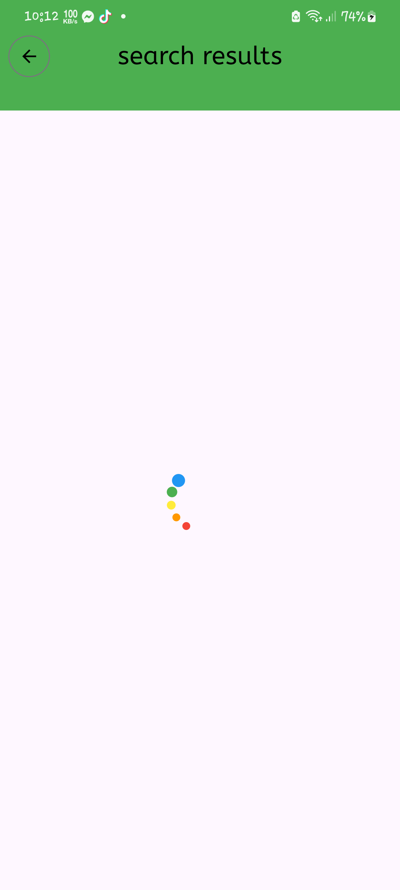

# 📰 NewsApp

A modern Flutter application for browsing and searching the latest news articles.

---

## 🚀 Features
- Latest News: Stay updated with the latest headlines.
- Search Articles: Quickly find articles using keywords.
- User-Friendly Interface: Easy navigation with responsive design.

---

## 📸 Screenshots
#### Latest News
<p align="center">

  


  
</p>
<p align="center">


  
</p>

#### Search News
<p align="center">
  


</p>

<p align="center">


  

  
</p>

---

## 🛠️ Tech Stack
- Flutter: Framework for building the UI.
- Dart: Programming language.
- GetX: State management, routing, and dependency injection.
- HTTP: API integration.
- Android Studio: IDE used for development.

---


## 🔗 Setup & Installation

1. **Clone the Repository:**
   ```bash
   git clone https://github.com/rabby220/Flutter-Newsapp.git
   
2. **Navigate to the project directory:**
   ```bash
   cd Flutter-Newsapp
   
3. **Install Dependencies::**
   ```bash
   flutter pub get
   
4. **Install Dependencies::**
   ```bash
   flutter run

---


## 🌐 API Integration
This app fetches news from the [**Currents API**](https://currentsapi.services/en).
- Replace the API key placeholder in your code with your own API key.


## 💻 Future Improvements
- Category Filtering: Add filters for different news categories.
- Favorites: Save and view favorite articles.
- Offline Access: Enable offline reading.

---

## 📫 Contact

Feel free to reach out via [LinkedIn](https://www.linkedin.com/in/flutterdevrabby/) or open an issue if you have any questions or suggestions!


